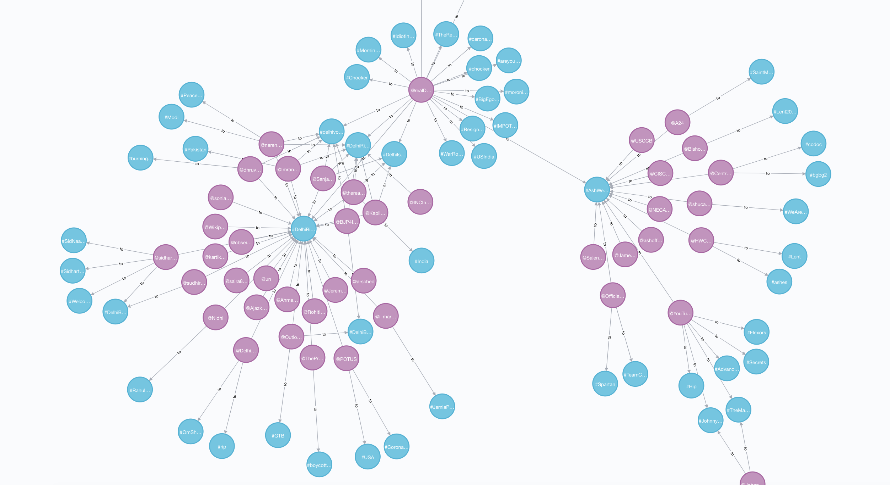

## kafka-spark-streaming-demo

This application streams tweets (in the aggregator written in Ruby) and produces Kafka messages (yes, I know...Spark Streaming is able to stream from Twitter directly...but I wanted to test Spark Streaming with _Kafka_). The Spark Streaming job looks for hashtags and users and creates relationships between them in Neo4j.

In Neo4j this looks like so:



### aggregator environment variables

```ini
TWITTER_CONSUMER_KEY="<your Twitter developers consumer key>"
TWITTER_CONSUMER_SECRET="<your Twitter developers consumer secret>"
TWITTER_ACCESS_TOKEN="<your Twitter developers access token specific to your 'app'>"
TWITTER_ACCESS_TOKEN_SECRET="<your Twitter developers access token secret specific to your 'app'>"
KAFKA_BROKERS="<Kafka brokers, comma seperated>"
KAFKA_CLIENT_ID="<Kafka client id>"
KAFKA_TOPIC="twitter-news-topic"
```
